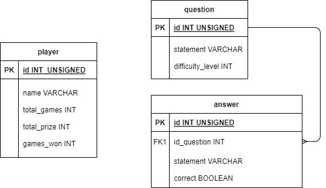

# RetoTecnico
Reto técnico (SofkaU)

Proyecto hecho en Java para la solución del reto de la liga de entrenamiento de desarrollo de software en SofkaU.

## Base de Datos.

Se utiliza una base de datos alojada en un servicio gratuito en la nube de MySQL llamado PlanetScale.
Por lo tanto, el usuario y contraseña para acceder a la base de datos se adjunta al correo enviado. Las credenciales deben ser agregadas en la clase
**src/database/DataBaseConnection** en las variables "USER" y "PASSWORD".

**Es importante tener el driver "com.mysql.cj.jdbc.Driver"** para que el programa se pueda conectar con la base de datos sin problemas. Descargar o importar
la librería: **mysql-connector-java-8.0.29** de <https://dev.mysql.com/downloads/connector/j/\>.

A continuación se tiene el diagrama entidad relación de la base de datos.

## Aplicación.

Para abrir el programa basta con ejecutar la clase Main.

Al dar click en 'Jugar' el jugador debe indicar su nombre. Si este nombre se encuentra en la base de datos, se cargan sus respectivos datos, de lo contrario
se creará un nuevo registro en ella. Una vez se inicie el juego, con cada respuesta acertada el jugador irá acumulando un premios y se gana el juego al finalizar las cinco rondas. También se puede optar por la opción 'Retirarse' antes de iniciar una nueva ronda, en este caso el jugador se llema el premio acumulado hasta el momento pero no se considera ganador de juego.

Si el jugador selecciona una respuesta incorrecta, automáticamente pierde el premio acumulado y deberá empezar de nuevo o salirse del juego.

En la opción 'Confoguración' en el menú principal se abrirá un nuevo menú donde se pueden agregar nuevas preguntas. Cada pregunta que se ingrese debe 
tener una respuesta correcta y tres respuestas erradas. Se puede cancelar el proceso si se desea pero la información ingresada se eliminará por completo.